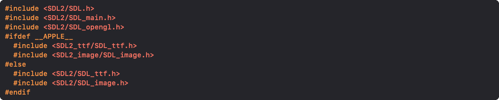

Simple Direct Layer

## Inclusion

Afin d'utiliser la librairie SDL2 ainsi que quelques-unes de ses extensions:

## Initialisation

Avant toutes choses, la librairie et ses extensions doivent être initialisées:

## Libération

Afin de libérer la librairie et quelques-unes de ses extensions:

