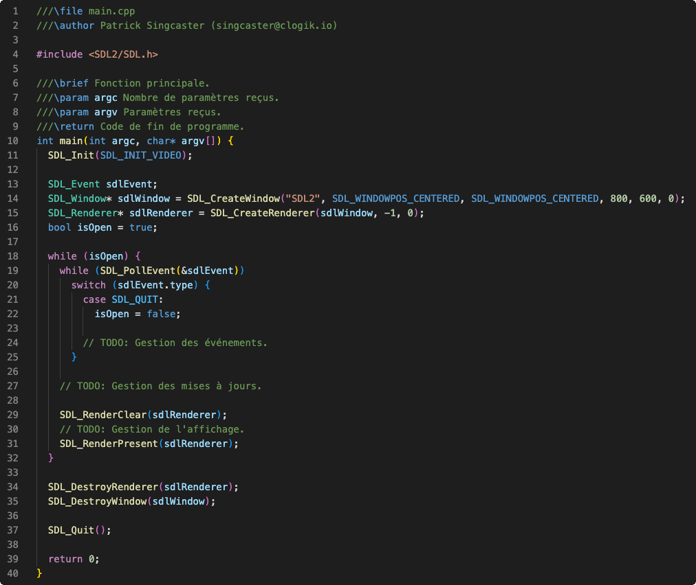

# Application

La boucle d'application comporte généralement les trois phases suivantes:

- Gestion des événements
- Gestion des mises à jour
- Gestion de l'affichage

Exemple minimaliste d'une application SDL2 mono fenêtre:

