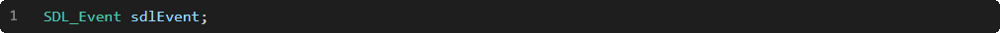

Il s'agit d'une structure pouvant contenir toutes les informations possibles de tous les événements possibles:

# Type

La donnée membre « type » permet d'identifier le type d'événement :

|Type               |Description                                   |
|-------------------|----------------------------------------------|
|SDL_KEYDOWN        |Touche du clavier enfoncée                    |
|SDL_KEYUP          |Touche du clavier relâchée                    |
|SDL_MOUSEMOTION    |Mouvement du pointeur de souris               |
|SDL_MOUSEBUTTONDOWN|Bouton de la souris enfoncé                   |
|SDL_MOUSEBUTTONUP  |Bouton de la souris relâché                   |
|SDL_MOUSEWHEEL     |Molette de la souris                          |
|SDL_QUIT           |Fin du programme                              |
|SDL_WINDOWEVENT    |Événement de fenêtre du système d'exploitation|
|...                |...                                           |

# Parcours

La fonction « SDL_PollEvent » permet de défiler un événement de la file d'attente, stocker ses informations dans une structure « SDL_Event » passée en paramètre, et retourner s'il reste des événements, ou non, dans la file d'attente :

